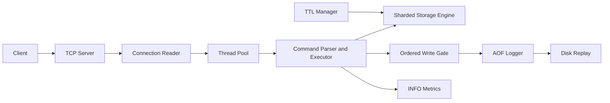

# ByteCacheDB

ByteCacheDB is a C++17 in-memory key-value database built around real TCP sockets, a
bounded command worker pool, sharded storage, TTL expiration, approximate LRU eviction,
sequence-ordered append-only persistence, and checkpoint snapshots.

## Architecture



Each connected socket has a lightweight blocking reader thread. Complete commands are
submitted to a fixed-size worker pool, so idle clients do not occupy command workers.
Responses remain ordered per connection. Storage is split into 64 hash shards by default,
each with its own `std::shared_mutex`.

When AOF is enabled, every mutating command holds one write-path mutex across the storage
mutation and AOF append. The sequence number and log order therefore match the global
mutation order.

## Features

- Real IPv4 TCP server with newline-delimited requests and Redis-style responses.
- 18 user commands including `MGET`, `MSET`, `INCR`, `DECR`, and `SAVE`.
- Request pipelining with in-order responses.
- Configurable sharded locking with per-shard maps and locks.
- Lazy and background TTL expiration using absolute persisted timestamps.
- Approximate LRU eviction with `--max-keys` and an eviction counter.
- Sequence-numbered AOF records with `always`, `everysec`, and `never` fsync policies.
- Atomic snapshot publication and sequence-aware snapshot plus AOF recovery.
- Quoted values with spaces and escaped quotes, slashes, tabs, and newlines.
- Graceful `SIGINT`/`SIGTERM` shutdown of the listener, clients, TTL manager, workers,
  snapshots, and AOF.
- Unit, concurrency, persistence, and real TCP integration tests.
- GitHub Actions CI, Docker packaging, demo script, and reproducible benchmarks.

## Commands

| Command | Result | Purpose |
| --- | --- | --- |
| `PING` | `+PONG` | Health check |
| `SET key value` | `+OK` | Set a value and clear its TTL |
| `GET key` | bulk string or `$-1` | Read a value |
| `DEL key` | integer | Delete a key |
| `EXISTS key` | integer | Test key existence |
| `EXPIRE key seconds` | integer | Set a relative TTL |
| `TTL key` | integer | Return remaining TTL |
| `PERSIST key` | integer | Remove a TTL |
| `KEYS` | array | List live keys |
| `FLUSH` | `+OK` | Remove all keys |
| `INFO` | bulk string | Return server metrics |
| `MSET key value ...` | `+OK` | Set multiple pairs atomically |
| `MGET key ...` | array | Read multiple keys |
| `INCR key` / `DECR key` | integer | Atomically change an integer |
| `APPEND key value` | integer | Append and return length |
| `STRLEN key` | integer | Return string length |
| `SAVE` | `+OK` | Write an atomic checkpoint snapshot |

Values containing whitespace use quotes:

```text
SET greeting "hello systems world"
GET greeting
```

## Build And Run

```bash
scripts/build.sh
./build/bytecachedb \
  --host 127.0.0.1 \
  --port 6379 \
  --threads 8 \
  --shards 64 \
  --enable-aof true \
  --aof-path data/bytecachedb.aof \
  --snapshot-path data/bytecachedb.snapshot \
  --fsync everysec \
  --max-keys 1000000
```

`--max-keys 0` disables the key limit. `--fsync` accepts `always`, `everysec`, or
`never`. `scripts/run_server.sh` exposes the same settings through `BYTECACHEDB_*`
environment variables.

Try a complete build, command sequence, and 10,000-request benchmark:

```bash
scripts/demo.sh
```

## Persistence

AOF records have a monotonic sequence prefix. With AOF enabled, successful mutations and
their records share a global ordering boundary. `EXPIRE` is logged as an absolute
`EXPIREAT` timestamp so a restart never extends a TTL.

Fsync policies:

| Policy | Behavior |
| --- | --- |
| `always` | `fsync` before acknowledging every logged mutation |
| `everysec` | background `fsync` approximately once per second and during shutdown |
| `never` | rely on operating-system writeback |

`SAVE` writes the live keyspace to a temporary snapshot, calls `fsync`, and atomically
renames it. The snapshot records its AOF sequence; recovery loads the snapshot and only
replays newer AOF records. LRU victims are logged as explicit `DEL` records so read-driven
eviction decisions reproduce exactly even though reads themselves are not logged.

## Correctness Guarantees

- Per-key operations are synchronized by the owning shard and are safe under concurrent
  access.
- `MSET` locks all affected shards in stable shard order, preventing partial visibility.
- Concurrent `INCR`/`DECR` operations on one key are atomic.
- With AOF enabled, logged writes replay in the same global order in which mutations ran.
- Responses on one TCP connection preserve request order, including pipelined requests.
- Expired keys are never returned after their absolute expiration time; lazy access and
  the background sweeper both remove them.
- Snapshot checkpoints and subsequent AOF records are separated by sequence number.

The database does not provide transactions, rollback after a disk-write failure,
replication, or cross-process consensus. Durability is strict only with `--fsync always`;
`everysec` can lose roughly the latest second after a power failure, and `never` can lose
more.

## INFO Metrics

`INFO` includes:

- uptime and QPS since startup
- connected clients and total commands
- total keys and approximate memory bytes
- expired and evicted key counters
- AOF status and fsync policy
- command worker count and storage shard count

## Tests

```bash
scripts/run_tests.sh
```

CTest runs six binaries covering parsing and quoted values, storage and eviction,
expiration, snapshots and AOF replay, multithreaded access, and black-box TCP behavior.
The TCP suite binds an ephemeral port and verifies `SET`, `GET`, `DEL`, `EXPIRE`,
pipelining, invalid commands, quoted values, graceful shutdown, and concurrent AOF replay
equivalence.

GitHub Actions runs the Release build and the entire suite on every push and pull request.

## Benchmark Results

All rows below use real TCP loopback connections, an 8-worker/64-shard Release server,
AOF disabled, 100,000 commands per row, and a mixed workload of 70% `GET`, 20% `SET`,
5% `DEL`, and 5% `EXPIRE`.

| Clients | Mode | QPS | Average ms | p50 ms | p95 ms | p99 ms |
| ---: | --- | ---: | ---: | ---: | ---: | ---: |
| 1 | request-response | 41,602 | 0.023 | 0.023 | 0.026 | 0.029 |
| 1 | pipeline 32 | 118,647 | 0.008 | 0.008 | 0.009 | 0.009 |
| 10 | request-response | 45,910 | 0.215 | 0.194 | 0.431 | 0.581 |
| 10 | pipeline 32 | 229,156 | 0.041 | 0.037 | 0.075 | 0.133 |
| 100 | request-response | 47,700 | 2.028 | 1.739 | 4.515 | 6.050 |
| 100 | pipeline 32 | 291,564 | 0.205 | 0.169 | 0.460 | 0.690 |

Recovery benchmark: 100,000 AOF records replayed in 0.108 seconds; 1,000 of 1,000
sampled keys matched.

### Methodology

- Machine: MacBook Air, Apple M3 (4 performance + 4 efficiency cores), 16 GB RAM.
- OS and compiler: macOS 26.2 arm64, AppleClang 17.0.0.
- Build flags: CMake `Release`, `-O3 -DNDEBUG -Wall -Wextra -Wpedantic`.
- Server: 8 command workers, 64 storage shards, AOF disabled.
- Client: Python 3 socket clients on `127.0.0.1`; 100,000 successful commands per case.
- Non-pipelined latency: one wall-clock request/response round trip per sample.
- Pipelined latency: batch round-trip divided by the number of commands in that batch.
- Percentiles: samples are sorted and indexed at `round(p * (N - 1))`.
- Pipelined latency is an amortized per-command measurement and should not be compared
  directly with independent request latency from a different harness.

Reproduce the matrix:

```bash
scripts/run_server.sh
scripts/run_benchmarks.sh
```

Raw data is committed in
[`benchmarks/matrix_results.json`](benchmarks/matrix_results.json).

## Docker

```bash
docker build -t bytecachedb .
docker run --rm -p 6379:6379 -v bytecachedb-data:/data bytecachedb
```

## Limitations

- ByteCacheDB is a single-node database; it is not distributed and has no replication.
- The protocol resembles Redis responses but is not Redis-compatible or binary-safe.
- Socket readers use one blocking thread per connection; command execution is bounded by
  the worker pool, but an event loop would scale better for very large idle populations.
- There is no authentication, authorization, TLS, transaction support, or scripting.
- AOF compaction is not implemented, so write-heavy logs grow until manually rotated.
- Approximate LRU uses timestamps and a global eviction scan, not Redis's sampling model.

## Resume Bullets

- Built a C++17 in-memory database with real TCP pipelining, 64-way sharded locking,
  atomic counters, TTL, approximate LRU, snapshots, and 18 commands.
- Designed sequence-ordered AOF persistence with configurable fsync policies and verified
  concurrent mutation/replay equivalence through black-box socket tests.
- Measured 292K QPS at 100 clients with pipeline depth 32 and 48K QPS in normal
  request-response mode on a 100,000-command mixed workload.
