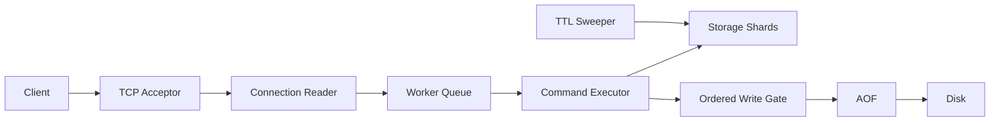

# Architecture

## Request Path

The acceptor owns the listening socket. Each accepted connection gets a lightweight
reader thread that buffers newline-delimited requests. Parsed work is submitted to a
fixed-size command pool, and the reader waits for each result before advancing, preserving
connection order.

This separates idle socket waiting from command workers. The remaining one-reader-thread
per connection model is deliberate and portable; `epoll`/`kqueue` would be the next
networking scalability step.

## Storage

Keys are assigned by `hash(key) % shard_count`. Each shard owns an
`unordered_map<string, ValueEntry>` and `shared_mutex`. Single-key operations lock one
shard. `MSET`, snapshots, `KEYS`, and `FLUSH` lock their required shards in index order.

Global atomics track live keys and evictions. When `--max-keys` is exceeded, an eviction
coordinator samples the oldest timestamp visible across shards and removes a victim.

## Durability

With AOF enabled, a server-wide mutex spans command mutation and AOF append. AOF records
receive monotonic sequence numbers under the file mutex. This produces one replay order
that matches the actual write order across all command workers.

`SAVE` captures the live keyspace and current sequence, writes a temporary file, syncs it,
and atomically renames it. Recovery loads that checkpoint and skips AOF records at or
before the checkpoint sequence. Evictions are appended as explicit `DEL` records, while
implicit max-key eviction is disabled during replay.

## Lifecycle

`SIGINT` and `SIGTERM` are blocked in all workers and consumed by a dedicated `sigwait`
thread. Shutdown closes the listener, calls `shutdown` on active clients, stops TTL
cleanup, joins connection readers, drains/stops command workers, syncs AOF state, and
closes files.
